# 🧠 GitGraph RAG: Complete Architecture & Deployment Guide

> **A $0 Hybrid Search Engine for GitHub Repository Discovery**  
> Built for 2026 | Free Tier Only | Production Ready

---

## 📋 Table of Contents

1. [The Problem](#-the-problem)
2. [The Solution](#-the-solution)
3. [Tech Stack ($0 Budget)](#-tech-stack-0-budget)
4. [System Architecture](#-system-architecture)
5. [Data Flow](#-data-flow)
6. [Agent Workflow](#-agent-workflow-langgraph)
7. [Database Design](#-database-design)
8. [Deployment Strategy](#-deployment-strategy)
9. [Implementation Roadmap](#-implementation-roadmap)
10. [Cost Breakdown](#-cost-breakdown)

---

## 🎯 The Problem

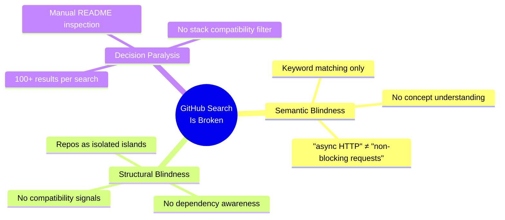

### Real Example:
> **User Query:** "PDF parser that works with LangChain in Python"
> 
> **GitHub Search Result:** 500+ repos with "PDF" or "Python" in name
> 
> **What User Actually Needs:** Repos that `import langchain` AND handle PDFs

---

## 💡 The Solution

### GitGraph RAG = Vector Search + Graph Traversal

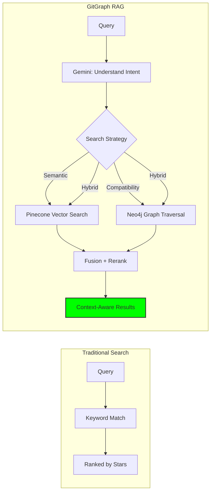

### What Makes This Different:

| Aspect | GitHub Search | GitGraph RAG |
|--------|---------------|--------------|
| Query Understanding | Literal keywords | Semantic intent |
| "works with X" |  Not possible |  Graph traversal |
| "alternatives to X" |  Manual search | ✅ `ALTERNATIVE_TO` edges |
| Stack compatibility | ❌ Read every README | ✅ Dependency graph filter |

---

## � How We Solve Each Problem (Detailed)

### Problem 1: Semantic Blindness

> **The Issue:** GitHub only matches exact keywords. "async HTTP client" won't find "non-blocking request library"

```mermaid
flowchart TB
    subgraph "❌ GitHub's Approach"
        Q1["Query: async HTTP client"] --> KW[Keyword Matcher]
        KW --> R1["Results: repos with 'async' OR 'HTTP' in name"]
        R1 --> MISS["❌ Misses: aiohttp, httpx, asks"]
    end
    
    subgraph "✅ GitGraph's Solution"
        Q2["Query: async HTTP client"] --> EMB[Gemini Embedding]
        EMB --> VEC["Vector: [0.23, 0.87, ...]"]
        VEC --> PC[(Pinecone)]
        PC --> SEM["Semantic Similarity Search"]
        SEM --> HIT["✅ Finds: aiohttp, httpx, asks, treq"]
    end
    
    style MISS fill:#ff6b6b
    style HIT fill:#4ade80
```

#### The Solution Flow:

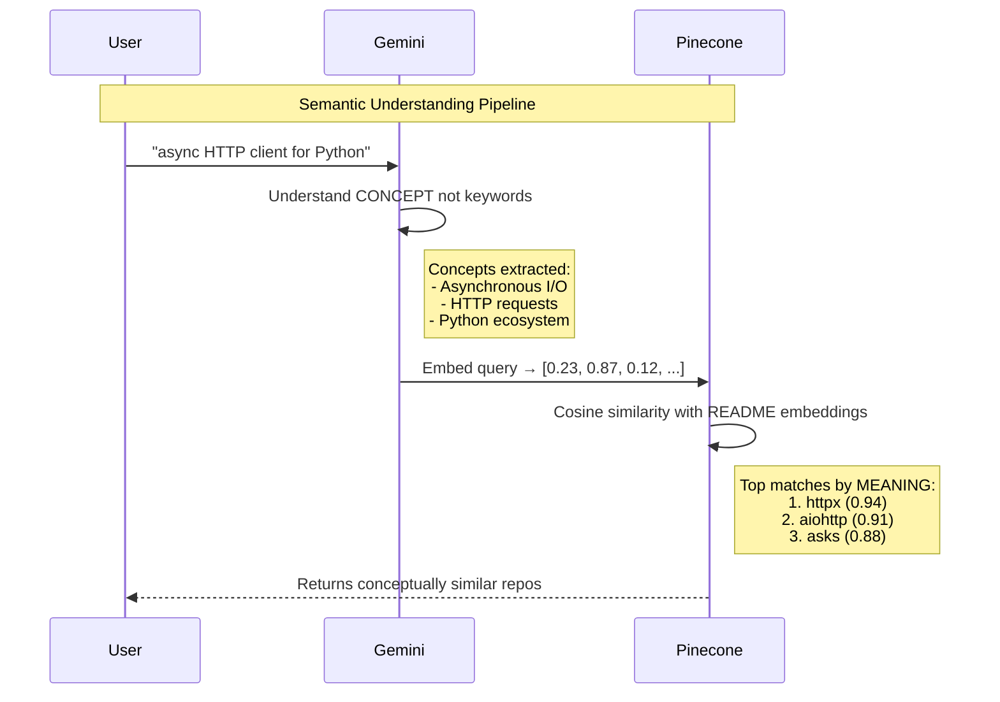

---

### Problem 2: Structural Blindness

> **The Issue:** GitHub treats repos as isolated. Can't answer "what works with LangChain?"

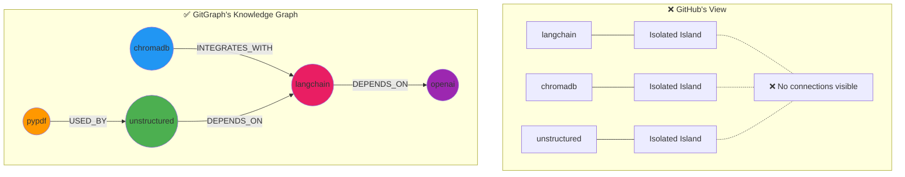

#### The Solution Flow:

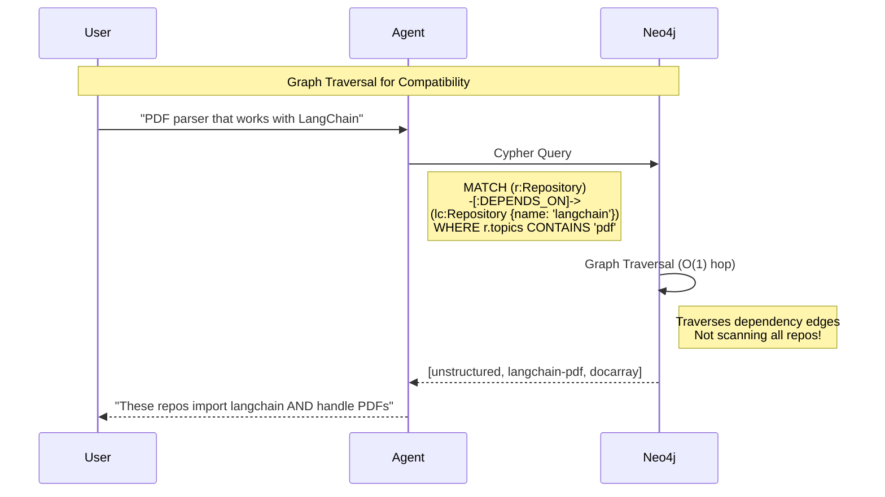

#### Example Cypher Queries:

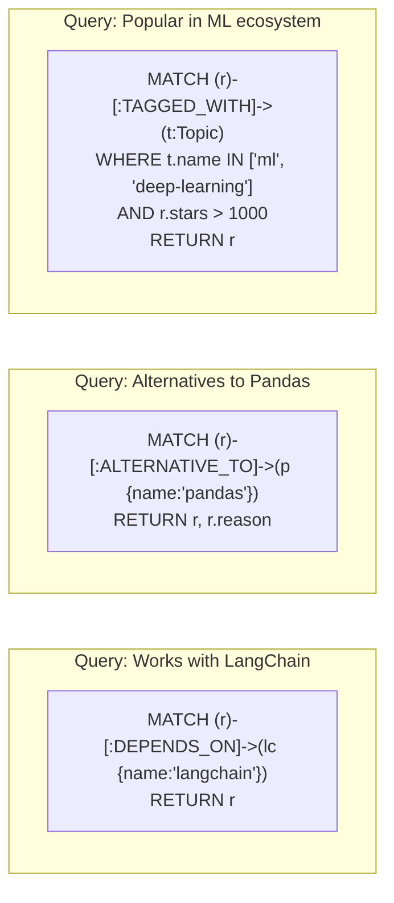

---

### Problem 3: Decision Paralysis

> **The Issue:** 500 results, no way to filter by YOUR specific stack

```mermaid
flowchart TB
    subgraph "❌ GitHub Experience"
        SEARCH["Search: 'PDF parser Python'"] --> RESULTS["500+ Results"]
        RESULTS --> MANUAL["Manual inspection of each README"]
        MANUAL --> HOURS["⏰ Hours of research"]
        HOURS --> MAYBE["Maybe find the right one?"]
        
        style MAYBE fill:#ff6b6b
    end
    
    subgraph "✅ GitGraph Experience"
        QUERY["Query: 'PDF parser for my LangChain + FastAPI stack'"] --> AGENT["LangGraph Agent"]
        AGENT --> HYBRID["Hybrid Search"]
        HYBRID --> FILTER["Stack-aware filtering"]
        FILTER --> TOP3["Top 3 recommendations with reasons"]
        TOP3 --> DONE["✅ Decision in 3 seconds"]
        
        style DONE fill:#4ade80
    end
```

#### The Intelligent Filtering Pipeline:

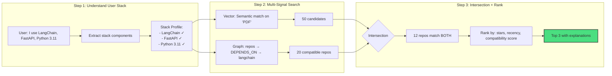

---

### The Complete Problem → Solution Mapping

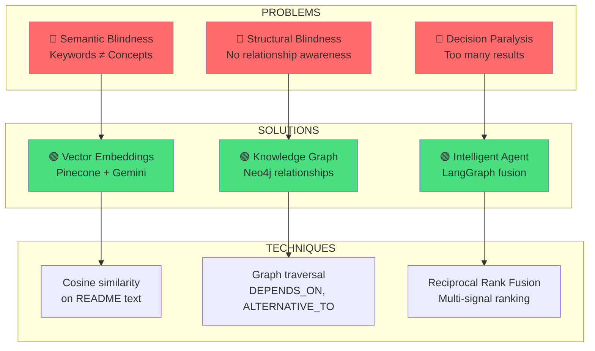

---

### End-to-End Query Resolution

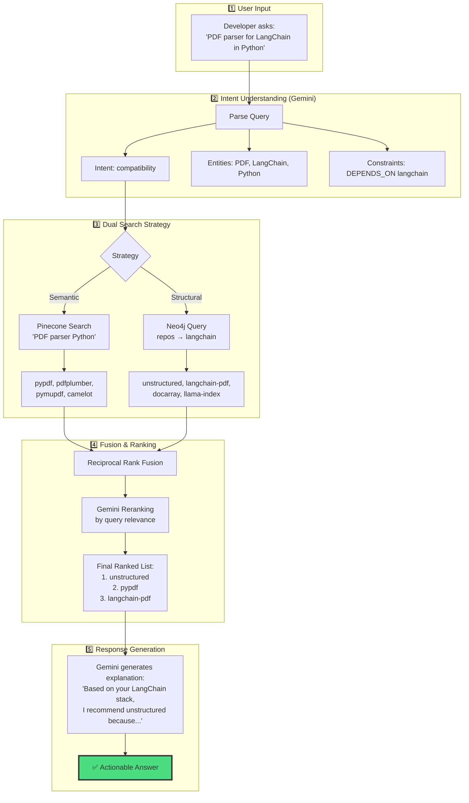

---

### Why This Architecture Works

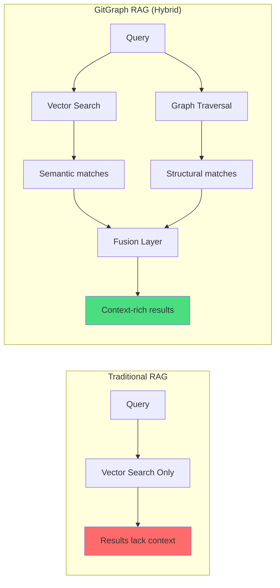

| Approach | Strength | Weakness | GitGraph Combines Both |
|----------|----------|----------|------------------------|
| **Vector Only** | Finds similar concepts | Can't verify compatibility | ✅ Semantic understanding |
| **Graph Only** | Perfect for relationships | Can't handle fuzzy queries | ✅ Structural awareness |
| **Hybrid (Ours)** | Best of both worlds | Complexity | ✅ Managed by LangGraph |

---

## �🛠 Tech Stack ($0 Budget)

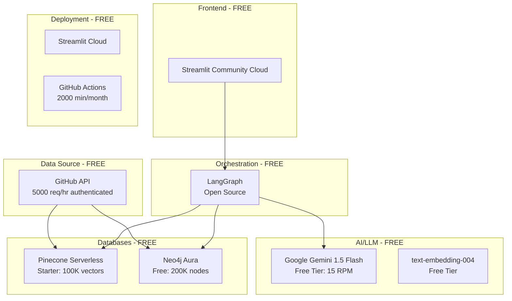

### Why These Specific Tools?

| Tool | Why Not Alternatives? |
|------|----------------------|
| **Gemini 1.5 Flash** | 1M token context (vs GPT-4o's 128K). Can process entire sub-graphs. |
| **Neo4j Aura** | Native graph traversal. SQL/Mongo can't do O(1) relationship hops. |
| **Pinecone** | Serverless = no cold starts. Weaviate/Qdrant need self-hosting. |
| **LangGraph** | Cyclic workflows. LangChain is linear, can't retry/switch strategies. |
| **Streamlit** | Python-native. Next.js would need separate backend. |

---

## 🏗 System Architecture

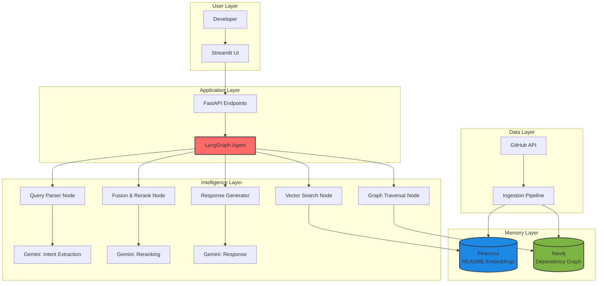

---

## 🔄 Data Flow

### Query Processing Flow

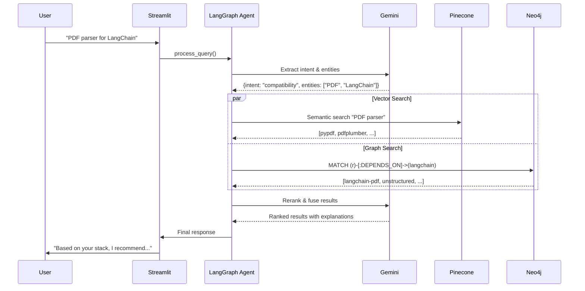

### Data Ingestion Flow

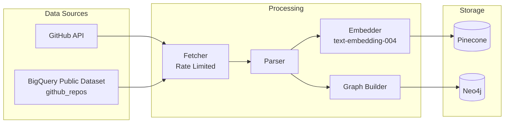

---

## 🤖 Agent Workflow (LangGraph)

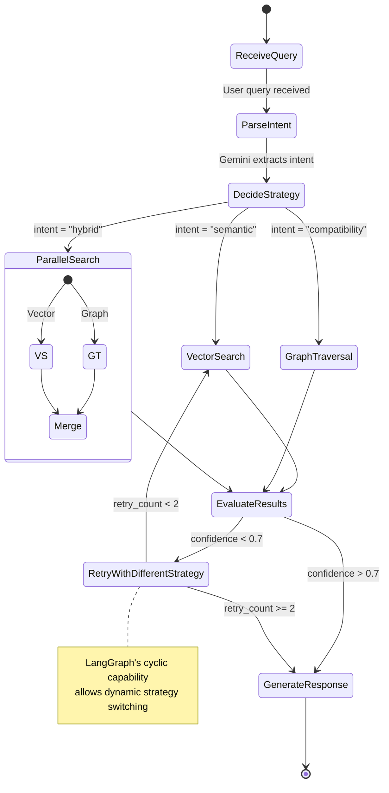

### Agent State

```python
class GitGraphState(TypedDict):
    # Input
    query: str
    
    # Extracted
    intent: Literal["semantic", "compatibility", "alternative", "hybrid"]
    entities: list[str]
    constraints: dict
    
    # Search Results
    vector_results: list[RepoResult]
    graph_results: list[RepoResult]
    
    # Control Flow
    strategy_attempts: int
    current_strategy: str
    confidence_score: float
    
    # Output
    final_response: str
    recommended_repos: list[RepoResult]
```

---

## 🗄 Database Design

### Neo4j Graph Schema

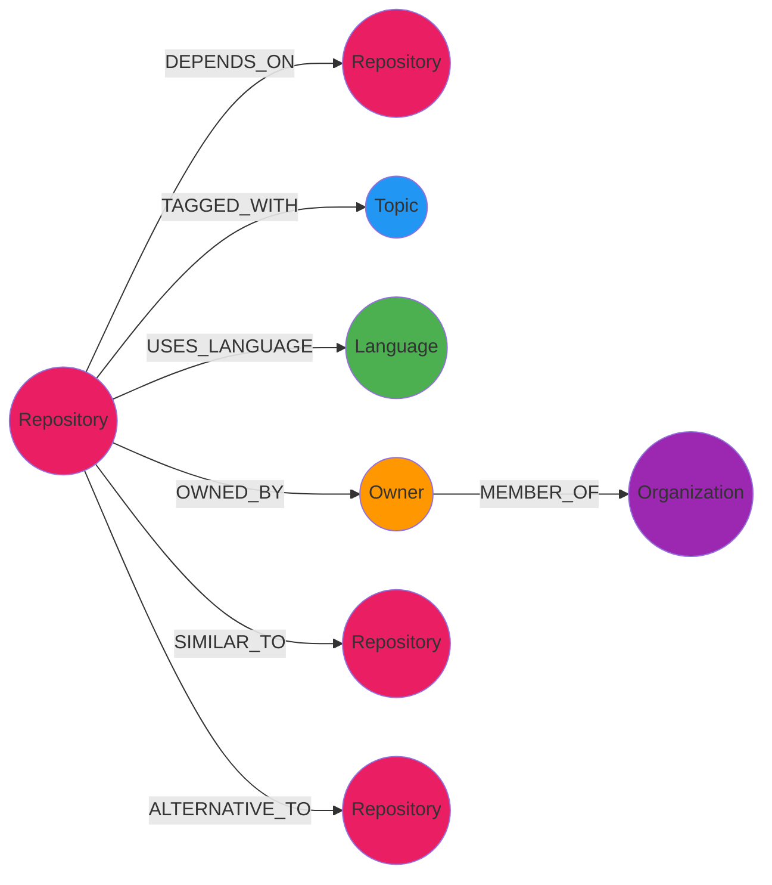

### Node Properties

| Node | Properties |
|------|------------|
| `Repository` | `name`, `full_name`, `description`, `stars`, `forks`, `last_updated`, `readme_vector_id`, `license` |
| `Topic` | `name`, `count`, `category` |
| `Language` | `name`, `ecosystem` |
| `Owner` | `login`, `type`, `followers`, `repos_count` |

### Relationship Properties

| Relationship | Properties |
|--------------|------------|
| `DEPENDS_ON` | `version`, `is_dev`, `is_optional` |
| `SIMILAR_TO` | `similarity_score` (cosine), `method` |
| `ALTERNATIVE_TO` | `reason`, `confidence`, `source` |

### Pinecone Index Schema

```python
{
    "id": "owner/repo-name",
    "values": [0.1, 0.2, ...],  # 768-dim embedding
    "metadata": {
        "name": "repo-name",
        "owner": "owner",
        "stars": 1500,
        "language": "Python",
        "topics": ["machine-learning", "nlp"],
        "chunk_index": 0,
        "chunk_text": "First 500 chars of README..."
    }
}
```

---

## 🚀 Deployment Strategy

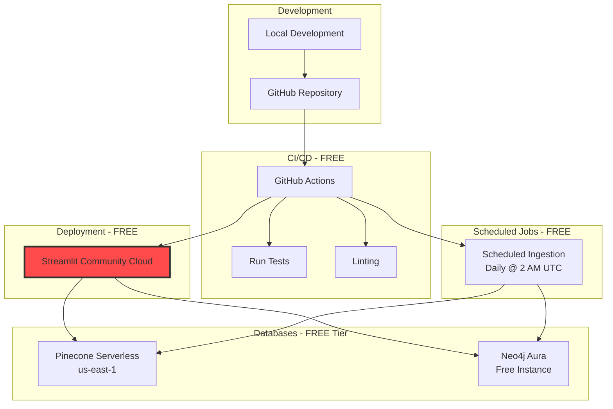

### Deployment Platforms (All $0)

| Component | Platform | Free Tier Limits |
|-----------|----------|-----------------|
| **Frontend + Backend** | Streamlit Community Cloud | Unlimited public apps |
| **Vector DB** | Pinecone Serverless | 100K vectors, 1 index |
| **Graph DB** | Neo4j Aura | 200K nodes, 400K relationships |
| **LLM API** | Google AI Studio | 15 RPM, 1M TPM |
| **CI/CD** | GitHub Actions | 2000 min/month |
| **Data Refresh** | GitHub Actions CRON | Free with repo |

### Environment Variables (Secrets)

```bash
# .streamlit/secrets.toml (for Streamlit Cloud)
GOOGLE_API_KEY = "your-gemini-api-key"
PINECONE_API_KEY = "your-pinecone-key"
NEO4J_URI = "neo4j+s://xxxxx.databases.neo4j.io"
NEO4J_USER = "neo4j"
NEO4J_PASSWORD = "your-password"
GITHUB_TOKEN = "ghp_xxxxx"  # For API rate limits
```

---

## 📅 Implementation Roadmap

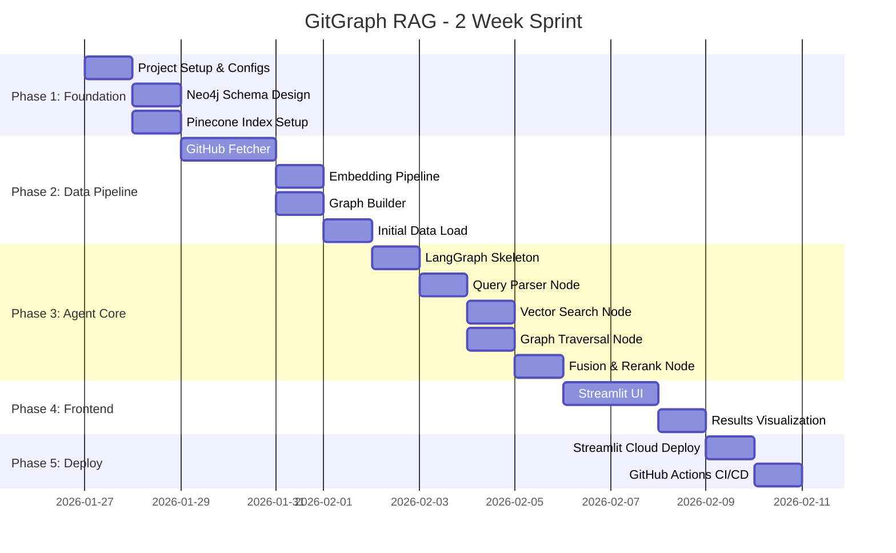

### Phase Breakdown

#### Phase 1: Foundation (Days 1-2)
```
□ Initialize project structure
□ Set up virtual environment
□ Create Neo4j Aura instance
□ Create Pinecone index
□ Configure environment variables
□ Set up Git repository
```

#### Phase 2: Data Pipeline (Days 3-5)
```
□ Build GitHub API client with rate limiting
□ Parse requirements.txt / pyproject.toml / package.json
□ Create README embedding pipeline
□ Build Cypher queries for graph population
□ Load initial dataset (1000 popular repos)
```

#### Phase 3: Agent Core (Days 6-9)
```
□ Define LangGraph state schema
□ Implement query parser (Gemini)
□ Implement vector search node
□ Implement graph traversal node
□ Implement fusion logic (RRF)
□ Implement response generator
□ Add retry/fallback logic
```

#### Phase 4: Frontend (Days 10-11)
```
□ Build Streamlit layout
□ Create search input component
□ Build results cards
□ Add graph visualization (optional)
□ Style with custom CSS
```

#### Phase 5: Deployment (Days 12-14)
```
□ Push to GitHub
□ Connect Streamlit Cloud
□ Configure secrets
□ Set up GitHub Actions for data refresh
□ Write README documentation
□ Create demo video
```

---

## 💰 Cost Breakdown

```mermaid
pie title Monthly Operating Cost
    "Streamlit Cloud" : 0
    "Pinecone Starter" : 0
    "Neo4j Aura Free" : 0
    "Gemini Free Tier" : 0
    "GitHub Actions" : 0
    "Domain (Optional)" : 0
```

### Detailed Cost Analysis

| Service | Free Tier Limit | Our Usage | Monthly Cost |
|---------|-----------------|-----------|--------------|
| Streamlit Cloud | Unlimited public apps | 1 app | **$0** |
| Pinecone Serverless | 100K vectors | ~50K | **$0** |
| Neo4j Aura | 200K nodes | ~100K | **$0** |
| Gemini 1.5 Flash | 15 RPM, 1M TPM | ~10 RPM avg | **$0** |
| GitHub Actions | 2000 min/month | ~100 min | **$0** |
| Custom Domain | Optional | - | **$0-12/yr** |
| **TOTAL** | | | **$0** |

### Scaling Path (If Needed Later)

| Trigger | Upgrade Path | New Cost |
|---------|--------------|----------|
| >100K vectors | Pinecone Standard | $70/mo |
| >200K nodes | Neo4j Aura Pro | $65/mo |
| >15 RPM sustained | Gemini Pay-as-you-go | ~$0.001/query |
| Custom domain | Namecheap/Cloudflare | $12/year |

---

## 🎯 Success Metrics

```mermaid
graph LR
    subgraph "User Metrics"
        A[Query to Result: < 3s]
        B[Result Relevance: > 80%]
        C[User Retention: Daily Active]
    end
    
    subgraph "Technical Metrics"
        D[API Latency: < 500ms]
        E[Error Rate: < 1%]
        F[Uptime: 99%]
    end
    
    subgraph "Portfolio Metrics"
        G[GitHub Stars]
        H[Demo Views]
        I[Interview Mentions]
    end
```

---

## 📁 Final Project Structure

```
GITGRAPH/
├── .streamlit/
│   └── secrets.toml          # API keys (gitignored)
├── .github/
│   └── workflows/
│       ├── ci.yml            # Test & lint
│       └── data-refresh.yml  # Daily ingestion
├── app/
│   ├── main.py               # Streamlit entry
│   ├── components/
│   │   ├── search_bar.py
│   │   ├── result_card.py
│   │   └── graph_viz.py
│   └── styles/
│       └── custom.css
├── agent/
│   ├── graph.py              # LangGraph definition
│   ├── state.py              # State schema
│   └── nodes/
│       ├── query_parser.py
│       ├── vector_search.py
│       ├── graph_traversal.py
│       ├── fusion.py
│       └── response_gen.py
├── db/
│   ├── neo4j_client.py
│   ├── pinecone_client.py
│   └── schemas.py
├── ingestion/
│   ├── github_fetcher.py
│   ├── dependency_parser.py
│   ├── embedder.py
│   └── graph_builder.py
├── tests/
│   ├── test_agent.py
│   └── test_ingestion.py
├── requirements.txt
├── README.md
└── ARCHITECTURE.md           # This file
```

---

## 🔗 Quick Links

| Resource | URL |
|----------|-----|
| Streamlit Cloud | https://streamlit.io/cloud |
| Neo4j Aura | https://neo4j.com/cloud/aura/ |
| Pinecone | https://www.pinecone.io/ |
| Google AI Studio | https://aistudio.google.com/ |
| LangGraph Docs | https://langchain-ai.github.io/langgraph/ |

---

> **Built with Ramakrishna | 2026**  
> *Proving that $0 budget ≠ $0 value*
